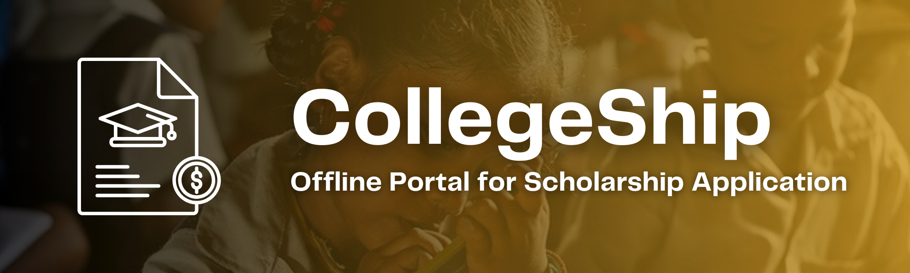

<a name="readme-top"></a>

[![Contributors][contributors-shield]][contributors-url]
[![Forks][forks-shield]][forks-url]
[![Stargazers][stars-shield]][stars-url]
[![Issues][issues-shield]][issues-url]
[![LinkedIn][linkedin-shield]][linkedin-url]

<!-- PROJECT LOGO -->
<br/>
<div align="center">
  <a href="https://github.com/siddhesh-desai/CollegeShip">
    
  </a>
    <br>
    <br>

  <h3 align="center"><b>CollegeShip</b></h3>

  <p align="center">
    CollegeShip is an offline portal for application for scholarships for the students in rural areas.
    <br />
    <br>
    <a href="https://github.com/siddhesh-desai/CollegeShip"><strong>Explore the docs »</strong></a>
    <br />
    <a href="https://github.com/siddhesh-desai/CollegeShip">View Demo</a>
    ·
    <a href="https://github.com/siddhesh-desai/CollegeShip/issues">Report Bug</a>
    ·
    <a href="https://github.com/siddhesh-desai/CollegeShip/issues">Request Feature</a>
  </p>
</div>

<!-- ABOUT THE PROJECT -->
<br>

## ♾️ About The Project

CollegeShip is an innovative offline portal designed to facilitate the application process for scholarships for students in rural areas. Recognizing the limited internet access in such areas, CollegeShip provides a solution by allowing candidates to visit their local Gram Panchayat for the application process. The project leverages advanced technologies, including OCR (Optical Character Recognition) and data transfer via memory devices, to streamline the application process and ensure accurate data collection.

In rural areas where internet connectivity is limited, CollegeShip addresses the digital divide by utilizing the infrastructure of local Gram Panchayats. Candidates can visit these centers and upload their scholarship application documents. With the integration of OCR technology, key details from the documents are automatically extracted and filled in the application form, reducing manual data entry and minimizing errors.

To facilitate the offline data collection process, CollegeShip utilizes memory devices such as USB drives or portable hard drives. The collected data, including the completed application forms and supporting documents, is securely stored in these memory devices. Once the memory device is ready, it is transferred to a server at a location with internet connectivity, enabling the data to be seamlessly uploaded for processing.

The technology stack used in developing CollegeShip includes MERN (MongoDB, Express.js, React.js, Node.js) and Python. The MERN stack provides a robust and scalable foundation for the web application, allowing for efficient data storage, server-side processing, and dynamic user interfaces. Python, a versatile programming language, is employed for implementing the OCR functionality, enabling the extraction of relevant information from uploaded documents.

By employing advanced technologies and an offline approach, CollegeShip aims to bridge the digital divide and empower students in rural areas to access scholarship opportunities. The project streamlines the application process, reduces manual efforts, and ensures data accuracy. Additionally, it contributes to the efficient allocation of scholarships by facilitating seamless data transfer from offline centers to the central server for evaluation and decision-making.

CollegeShip serves as a powerful tool to promote educational opportunities and empower students in rural areas. By harnessing the MERN stack and Python's capabilities, the project demonstrates a commitment to leveraging technology for the benefit of underserved communities. With CollegeShip, students in rural areas can access scholarships that may have otherwise been inaccessible due to limited internet connectivity, helping them pursue their educational aspirations and contribute to their communities' growth and development.

<p align="right">(<a href="#readme-top">back to top</a>)</p>

## ⚙️ Built With

The technologies and tools used are:

- [![HTML][html]][html-url]
- [![CSS][css]][css-url]
- [![JavaScript][js]][js-url]
- [![MongoDB][mongodb]][mongodb-url]
- [![ExpressJS][express]][express-url]
- [![NodeJS][node]][node-url]
- [![Python][python]][python-url]

<p align="right">(<a href="#readme-top">back to top</a>)</p>

<!-- GETTING STARTED -->

## 🧑‍💻 Getting Started

Follow the below steps to set up the project locally:

### Prerequisites

You need to setup you MongoDB Clusters priorly and then follow the steps.

### Installation

1. Clone the repository

   ```sh
   git clone https://github.com/siddhesh-desai/CollegeShip.git
   ```

2. Install the dependencies:

   ```sh
   npm i
   ```

<p align="right">(<a href="#readme-top">back to top</a>)</p>

## 💡 Features

<br>

- Biometric Verification
- Encrypted Data Storage
- SMS Based Updates
- Offline System
- Optical Character Recognition

<p align="right">(<a href="#readme-top">back to top</a>)</p>

<!-- ROADMAP -->

## 🛣️ Roadmap

- [x] Biometric Verification
- [x] Encrypted Data Storage
- [x] SMS Based Updates
- [x] Offline System
- [x] Optical Character Recognition

See the [open issues](https://github.com/siddhesh-desai/CollegeShip/issues) for a full list of proposed features (and known issues).

<p align="right">(<a href="#readme-top">back to top</a>)</p>

<!-- CONTRIBUTING -->

## 👣 Contributing

Any contributions you make are **greatly appreciated**.

If you have a suggestion that would make this better, please fork the repo and create a pull request. You can also simply open an issue with the tag "enhancement".
Don't forget to give the project a star! Thanks again!

1. Fork the Project
2. Create your Feature Branch (`git checkout -b feature/AmazingFeature`)
3. Commit your Changes (`git commit -m 'Add some AmazingFeature'`)
4. Push to the Branch (`git push origin feature/AmazingFeature`)
5. Open a Pull Request

<p align="right">(<a href="#readme-top">back to top</a>)</p>

<!-- CONTACT -->

## 📧 Contact

Siddhesh Desai - [@thesiddheshdesai](https://www.linkedin.com/in/thesiddheshdesai/) - siddheshdesai777@gmail.com

Project Link: [https://github.com/siddhesh-desai/CollegeShip](https://github.com/siddhesh-desai/CollegeShip)

<p align="right">(<a href="#readme-top">back to top</a>)</p>

## ✨ Contributors

Thanks go to these wonderful people:

- [Siddhesh Desai](https://github.com/siddhesh-desai/)
- [Rajkumar Dongre](https://github.com/rajkumardongre/)
- [Sanket Disale](https://github.com/sanketdisale871/)
- [Sanskruti Khedkar](https://github.com/sanskrutikhedkar9/)
- [Samarth Bura](https://github.com/samarthNV/)
- [Tejaswini Wanare](https://github.com/Tejaswini-9703/)

[contributors-shield]: https://img.shields.io/github/contributors/siddhesh-desai/CollegeShip.svg?style=for-the-badge
[contributors-url]: https://github.com/siddhesh-desai/CollegeShip/graphs/contributors
[forks-shield]: https://img.shields.io/github/forks/siddhesh-desai/CollegeShip.svg?style=for-the-badge
[forks-url]: https://github.com/siddhesh-desai/CollegeShip/network/members
[stars-shield]: https://img.shields.io/github/stars/siddhesh-desai/CollegeShip.svg?style=for-the-badge
[stars-url]: https://github.com/siddhesh-desai/CollegeShip/stargazers
[issues-shield]: https://img.shields.io/github/issues/siddhesh-desai/CollegeShip.svg?style=for-the-badge
[issues-url]: https://github.com/siddhesh-desai/CollegeShip/issues
[license-shield]: https://img.shields.io/github/license/siddhesh-desai/CollegeShip.svg?style=for-the-badge
[license-url]: https://github.com/siddhesh-desai/CollegeShip/blob/master/LICENSE.txt
[linkedin-shield]: https://img.shields.io/badge/-LinkedIn-black.svg?style=for-the-badge&logo=linkedin&colorB=555
[linkedin-url]: https://linkedin.com/in/thesiddheshdesai
[html]: https://img.shields.io/badge/HTML-20232A?style=for-the-badge&logo=html5&logoColor=61DAFB
[html-url]: https://developer.mozilla.org/en-US/docs/Web/HTML
[css]: https://img.shields.io/badge/Css-000000?style=for-the-badge&logo=css3&logoColor=white
[css-url]: https://developer.mozilla.org/en-US/docs/Web/CSS
[js]: https://img.shields.io/badge/Javscript-0769AD?style=for-the-badge&logo=javascript&logoColor=white
[js-url]: https://developer.mozilla.org/en-US/docs/Web/javascript
[mongodb]: https://img.shields.io/badge/mongodb-20232A?style=for-the-badge&logo=mongodb&logoColor=61DAFB
[mongodb-url]: https://www.mongodb.com/docs/
[express]: https://img.shields.io/badge/expressjs-000000?style=for-the-badge&logo=express&logoColor=white
[express-url]: https://expressjs.com/
[node]: https://img.shields.io/badge/NodeJS-0769AD?style=for-the-badge&logo=node.js&logoColor=white
[node-url]: https://nodejs.org/en/docs
[python]: https://img.shields.io/badge/python-20232A?style=for-the-badge&logo=python&logoColor=61DAFB
[python-url]: https://docs.python.org/3/
